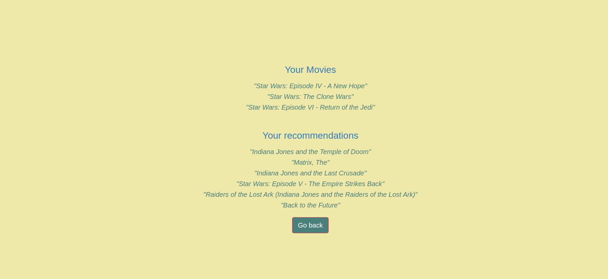

# Movie Recommender

A web base movie recommender engine using various models such as negative matrix factorization algorithm, user-based cosimilarity matrix and a custom item-based recommender algorithm that takes name of three movies and creates a new movie vector from the combination of them and recommend most similar movies.

## Usage:
 1. Clone this repository:
 2. Fill in your PostgreSQL connection string in the config.py
 3. Run read_and_train.py
 4. Run run_web.sh and go the provided link in your browser(localhost:5000)
 5. Enter name of three movies you like and choose a model for recommendation

## Model:
  1. NMF: Negative matrix factorization
  2. Cosim: User-based cosimilarity matrix model. This option creates a new user with ratings of the given movies (all consider 5) and recommend movies from similar user ratings
  3. Cosim Item: Item-based cosimilarity matrix model. This option recommend movies that most similar to each individual given movies_list
  4. Cosim Item Mix: Item-based cosimilarity matrix model. This option takes name of three movies and creates a new movie vector from the combination of them and recommend most similar movies in the database. (Recommend model for best results)

## Tech used:
 - Python
 - Flask
 - HTML
 - CSS
 - PostgreSQL
 - sqlalchemy
 - Scikit-learn
 - scipy
